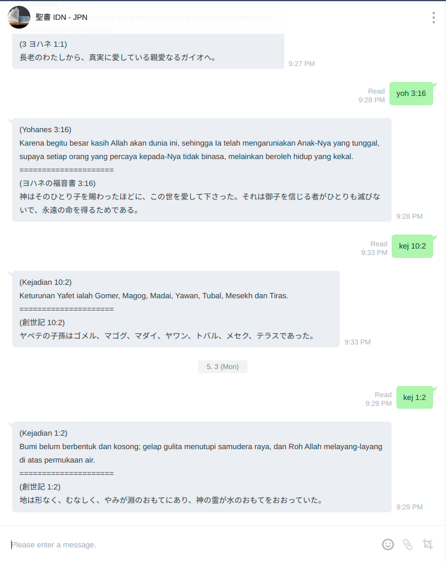

# Alkitab IDN - JPN
Christian Bible Line bot with AWS API Gateway and AWS Lambda as gateway. 
Source from [Sabda Labs](https://labs.sabda.org/API) and [FujiHaruka Bible Github Repo](https://github.com/FujiHaruka/bible-api)

# Usage
Bot Name: 聖書 IDN - JPN

QR Code:

1. Add Line bot to your friend (or group)
2. Chat with format "{BOOK} {PSALM} : {CHAPTER}"
3. Just wait for response!

# Installation
## Create Channel Provider from Line Developers
https://developers.line.biz/console/
1. Login to Line Developer
2. Create Provider
3. Choose "Messaging API" in Channel Setting
4. Get "Channel Access Token" and "Channel Secret" from the channel
5. Enable Webhook use

## Setting up and Lambda
1. Create Lambda with node.js runtime
2. Put "Channel Access Token" and "Channel Secret" in Lambda Environment Variable
3. Deploy

## Create and Setup API Gateway
1. Create "Rest API" type API
2. Create Resource
3. Create POST method in that resource
4. Setup method as lambda proxy and insert created lambda in there
5. Add Permission in Lambda
6. Deploy API

## Cretate Code Pipeline
1. Create Pipeline sourcing from Github (or other repo)
2. Add Codebuild to that pipeline

# Developer
SAM local support (developing, feel free to drop PR)!
